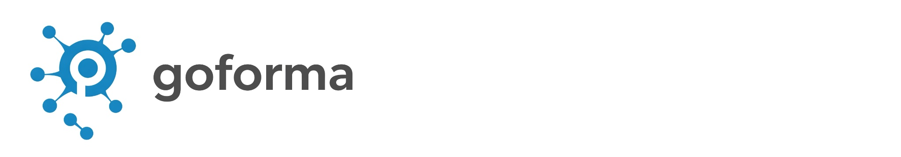
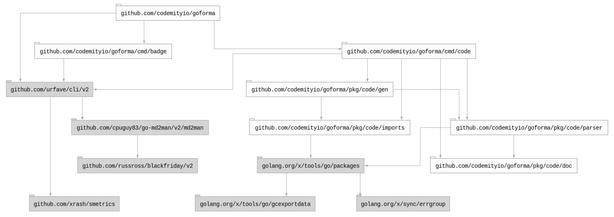

# 


## Table of contents

- [Summary](#summary)
- [Installation](#installation)
- [Usage](#usage)
  - [Manual](#manual)
  - [Subcommands](#subcommands)
  - [Docker](#docker)
- [Development](#development)
- [Packages](#packages)
- [Dependencies](#dependencies)
  - [Graph](#graph)
  - [Licenses](#licenses)
- [License](#license)

## Summary

Tool to support work with Go code.

## Installation

To install the package, run `make install` (directly from the repository clone) or use
`go install github.com/codemityio/goforma@latest`.

## Usage

Once installed, use the `goforma` command to get started.

### Manual

``` bash
$ goforma --help
NAME:
   goforma - A new cli application

USAGE:
   goforma [global options] command [command options]

VERSION:
   latest

DESCRIPTION:
   A tool to support work with Markdown.

AUTHOR:
   codemityio

COMMANDS:
   badge    
   code     
   help, h  Shows a list of commands or help for one command

GLOBAL OPTIONS:
   --help, -h     show help
   --version, -v  print the version

COPYRIGHT:
   codemityio
```

### Subcommands

- [`badge`](cmd/badge/README.md) - A simple tool to generate badges within a file.
- [`code`](cmd/code/README.md) - A simple tool to perform tasks on **Go** code.

### Docker

``` bash
$ docker run codemityio/goforma
```

## Development

To work with the codebase, use `make` command as the primary entry point for all project tools.

Navigate the available options using the arrow keys: `↓ ↑ → ←`. Use `/` to toggle search.

## Packages

- [`code`](pkg/code/README.md) - A package containing tools to perform code analysis, generate documentation and so on.

## Dependencies

### Graph



### Licenses

| Package                                 | Licence                                                         | Type         |
|-----------------------------------------|-----------------------------------------------------------------|--------------|
| github.com/cpuguy83/go-md2man/v2/md2man | https://github.com/cpuguy83/go-md2man/blob/v2.0.7/LICENSE.md    | MIT          |
| github.com/russross/blackfriday/v2      | https://github.com/russross/blackfriday/blob/v2.1.0/LICENSE.txt | BSD-2-Clause |
| github.com/urfave/cli/v2                | https://github.com/urfave/cli/blob/v2.27.7/LICENSE              | MIT          |
| github.com/xrash/smetrics               | https://github.com/xrash/smetrics/blob/686a1a2994c1/LICENSE     | MIT          |
| golang.org/x/mod/semver                 | https://cs.opensource.google/go/x/mod/+/v0.35.0:LICENSE         | BSD-3-Clause |
| golang.org/x/sync/errgroup              | https://cs.opensource.google/go/x/sync/+/v0.20.0:LICENSE        | BSD-3-Clause |
| golang.org/x/tools                      | https://cs.opensource.google/go/x/tools/+/v0.44.0:LICENSE       | BSD-3-Clause |

## License

This project is licensed under the MIT License. See the [LICENSE](LICENSE) file for details.
