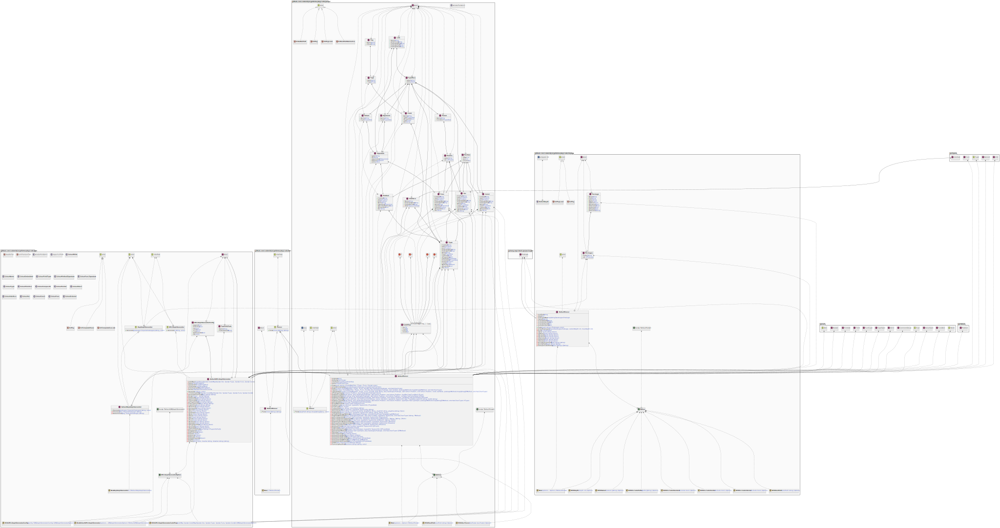
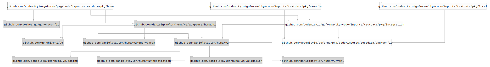
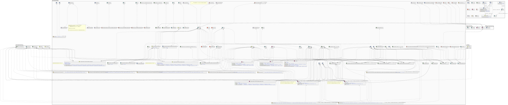
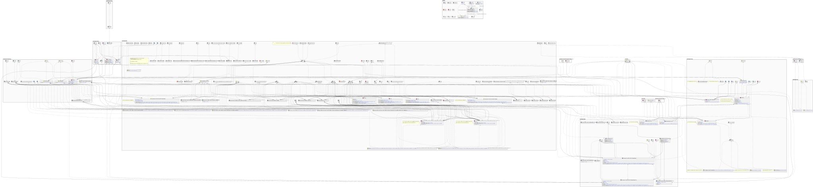
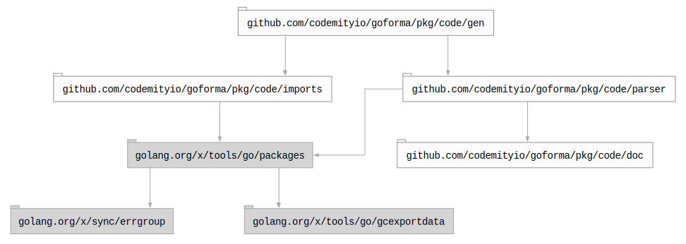

# `code`

## Table of contents

- [Summary](#summary)
- [Architecture](#architecture)
- [Subpackages](#subpackages)
  - [`doc`](#doc)
  - [`gen`](#gen)
    - [Dependency graph](#dependency-graph)
    - [UML graph](#uml-graph)
  - [`imports`](#imports)
  - [`parser`](#parser)
- [Dependencies](#dependencies)

## Summary

A package containing tools to perform code analysis, generate documentation and so on.

## Architecture

## Subpackages

### `doc`

Contains a code block document parser. Can be replaced with all code block comments formatter to generate documentation.

### `gen`

Contains diagram generators for both imports and **UML**.

#### Dependency graph

The following is an examples of a dependency graph.

 

#### UML graph

The following is an examples of a **UML** diagram generated from the test code.

 

### `imports`

Contains a tool to export dependency graph. It can be used to generate dependency tree diagram.

### `parser`

Contains a tool to parse a code and build a tree of relations. It can be used to generate a **UML** diagram.

## Dependencies

